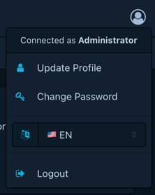
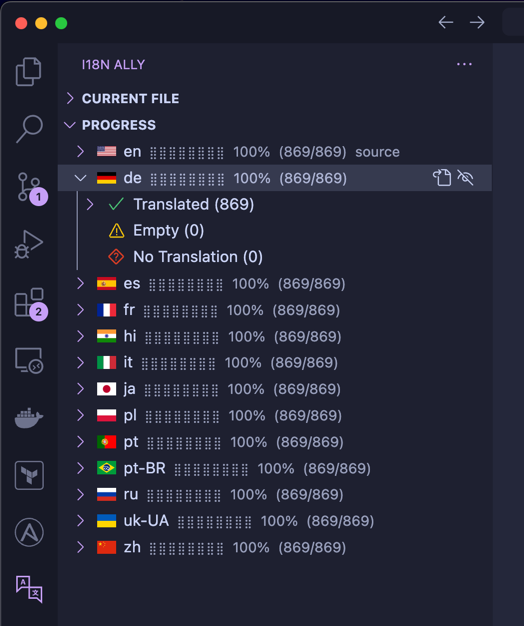
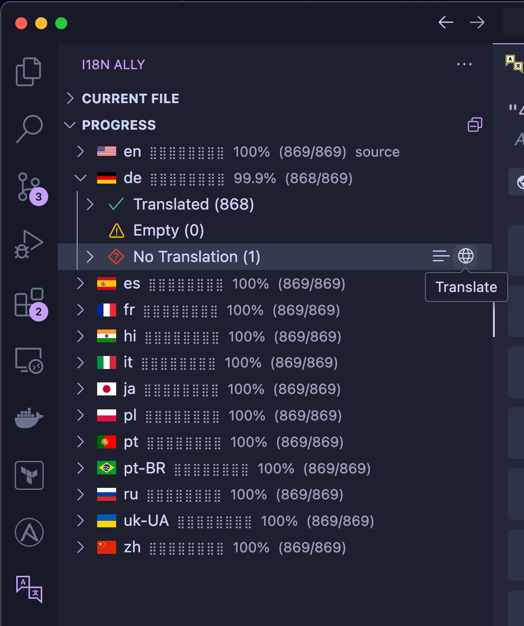

[](https://github.com/DependencyTrack/frontend/actions?workflow=Build+CI)
[](https://www.codacy.com/gh/DependencyTrack/frontend/dashboard?utm_source=github.com&utm_medium=referral&utm_content=DependencyTrack/frontend&utm_campaign=Badge_Grade)
[][License]
[](https://github.com/DependencyTrack/frontend/releases)

# Dependency-Track Front-End

The Front-End is a Single Page Application (SPA) used in Dependency-Track, an open source Component Analysis platform
that allows organizations to identify and reduce risk in the software supply chain.

The project is built with:

- Vue.js
- Bootstrap Vue
- CoreUI

<hr>


## Compatibility Matrix

Always use the Front-End version that is compatible with the Dependency-Track API Server in use.

| Dependency-Track API Server | Front-End     |
| :-------------------------- | :------------ |
| v4.2                        | v4.2          |
| v4.1                        | v1.2          |
| v4.0                        | v1.1          |
| v3.8                        | v1.0          |
| v1.0 - v3.7.1               | Not supported |

Starting with Dependency-Track v4.2, the API Server and the Frontend now have the same major and minor (semantic) version. Patch versions however, may continue to be unique.

## Binary Distributions

Pre-compiled distributions are available in two variants:

- [Docker container running NGINX](https://hub.docker.com/r/dependencytrack/frontend)
- [GitHub Release (zip archive)](https://github.com/DependencyTrack/frontend/releases)

The Docker container provides the fastest, most consistent deployment option and is recommended.
The Docker container includes NGINX and a pre-deployed Front-End release.

## Build Setup

```bash
# Install dependencies
npm install

# Serve with hot reload at localhost:8080
npm run serve

# Build for production with minification
npm run build

# Run linter
npm run lint

# Generates a CycloneDX software bill-of-materials
npm run bom
```

## Development Setup

In order to test with a Dependency-Track instance, the `.env.development` file needs to be modified and the `VUE_APP_SERVER_URL` property updated to
reflect the base URL of a Dependency-Track server.

## Deployment


The front-end is deployed to a general purpose web server (e.g. NGINX or Apache). To configure the front-end
for this scenario, simply change the value of API_BASE_URL in static/config.json.

```json
{
  "API_BASE_URL": "https://drack-server.example.com"
}
```

## Internationalization (i18n)

This project supports internationalization. Supported languages are:

- 🇩🇪 [German](src/i18n/locales/de.json)
- 🇺🇸 [English](src/i18n/locales/en.json)
- 🇪🇸 [Spanish](src/i18n/locales/es.json)
- 🇫🇷 [French](src/i18n/locales/fr.json)
- 🇮🇳 [Hindi](src/i18n/locales/hi.json)
- 🇮🇹 [Italian](src/i18n/locales/it.json)
- 🇯🇵 [Japanese](src/i18n/locales/ja.json)
- 🇵🇱 [Polish](src/i18n/locales/pl.json)
- 🇵🇹 [Portuguese](src/i18n/locales/pt.json)
- 🇧🇷 [Portuguese (Brazil)](src/i18n/locales/pt-BR.json)
- 🇷🇺 [Russian](src/i18n/locales/ru.json)
- 🇺🇦 [Ukrainian](src/i18n/locales/uk-UA.json)
- 🇨🇳 [Chinese](src/i18n/locales/zh.json)

Pull requests to add support for additional languages, or improve existing
ones are highly encouraged.

> [!NOTE]
> The core maintainers are currently able to support English and German.
> Other languages rely on community contributions, and will be subject to
> machine translation otherwise.

Dependency-Track tries to detect the language preference from the user's browser.
If no matching language is available, it will fall back to English.

Users can customize their language preference via the profile dropdown menu:



> [!NOTE]
> The page may need to be reloaded in order for the language preference to take
> affect across all elements of the application.

### Adding or Improving Translations

Translations are defined in `src/i18n/locales/{lang}.json`, for example [en.json](src/i18n/locales/en.json).
We recommend using [VS Code] with the [i18n Ally] extension when working on translation.
The extension provides an overview of translation progress across all languages:



In case of missing translations, it is possible to translate automatically using Google Translate.
To do this, hover over the _No Translation_ item of a language, and click the globe icon:



# Custom Favicon Configuration
You can configure a custom favicon for your Dependency-Track instance by setting the `DT_FAVICON_PATH` environment variable.

# Example:
`bash
DT_FAVICON_PATH=/assets/favicon-production.ico


## Copyright & License

Dependency-Track is Copyright (c) OWASP Foundation. All Rights Reserved.

Permission to modify and redistribute is granted under the terms of the
Apache 2.0 license. See the [LICENSE] file for the full license.

[License]: https://github.com/DependencyTrack/frontend/blob/master/LICENSE
[VS Code]: https://code.visualstudio.com/
[i18n Ally]: https://marketplace.visualstudio.com/items?itemName=lokalise.i18n-ally
