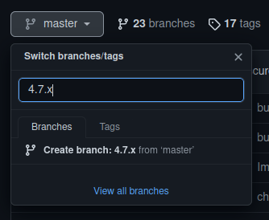
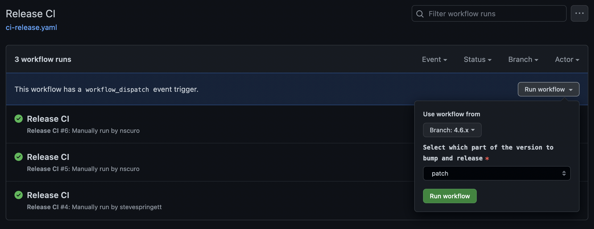

# Releasing the OWASP Dependency-Track Frontend

This document describes the process of releasing a new version of the Dependency-Track Frontend via GitHub Actions.

## Releasing

### Release a new major of minor version

1. Ensure the current state in `master` is ready to be released
2. Head over to the *Actions* tab in GitHub
3. Select the *Release CI* entry in the *Workflows* section
4. The following UI element will have a button to trigger the workflow. Once clicked, the Use workflow from dialog will appear:

5. Ensure that `master` is selected in the branch dropdown
6. For the part of the version to bump, select either `major` or `minor` (see [Semantic Versioning](https://semver.org/))
7. Finally, once all inputs are checked press the *Run Workflow* button
8. **Manually** create a release branch by selecting `master` in the branch dropdown and entering the branch name:

### Release a new bugfix version

1. Ensure the current state in the release branch is ready to be released
2. Head over to the *Actions* tab in GitHub
3. Select the *Release CI* entry in the *Workflows* section
4. The following UI element will have a button to trigger the workflow. Once clicked, the Use workflow from dialog will appear:

5. Ensure that a release branch (e.g. `4.6.x`) is selected in the branch dropdown
6. For the part of the version to bump, select `patch` (see [Semantic Versioning](https://semver.org/))
7. Finally, once all inputs are checked press the *Run Workflow* button
