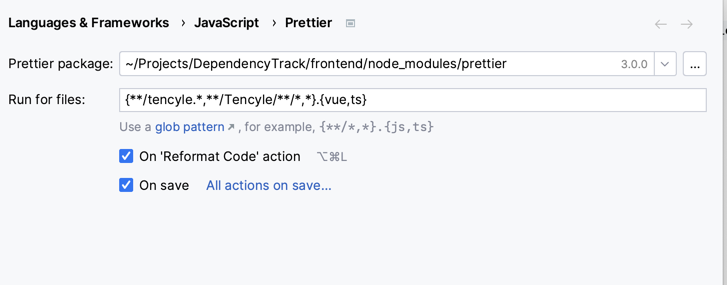

## Prettier
In your webstorm settings, search for `prettier` and enable the following options:

* Run on files: `{**/tencyle.*,**/Tencyle/**/*,*}.{vue,ts}`
Make sure that the `node_modules` folder is excluded from prettier formatting.
* On save: `Enable`
* On code reformat: `Enable`

